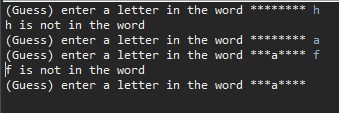
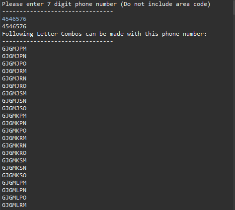
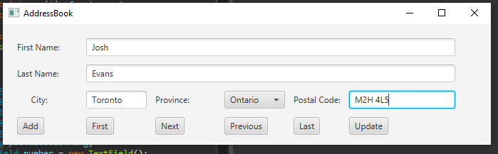
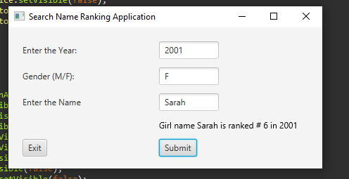
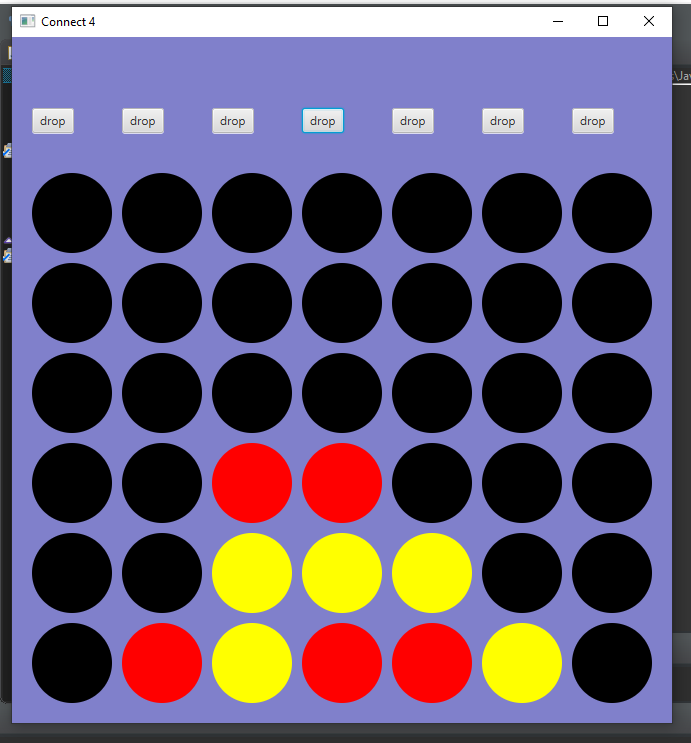

# JAC444JavaProjects
Java Projects, some with JavaFX.

All these programs can be downloaded and compiled.

# Some Screenshots of Various apps

# W1 - Hangman game with over 3000 words to choose from, words loaded from a file

# W4 - Generates all the letters combinations of a 7 digit phone number(no area code). Can be useful for advertising catch phrases.

# W6- Address Book application, use javafx for better appearance

# W7 - Baby Name ranker, finds how popular a baby name is from a given year. Rankings are stored in files and read into app with RAF

# W8 - Connect 4 Game with gui made with JavaFX

